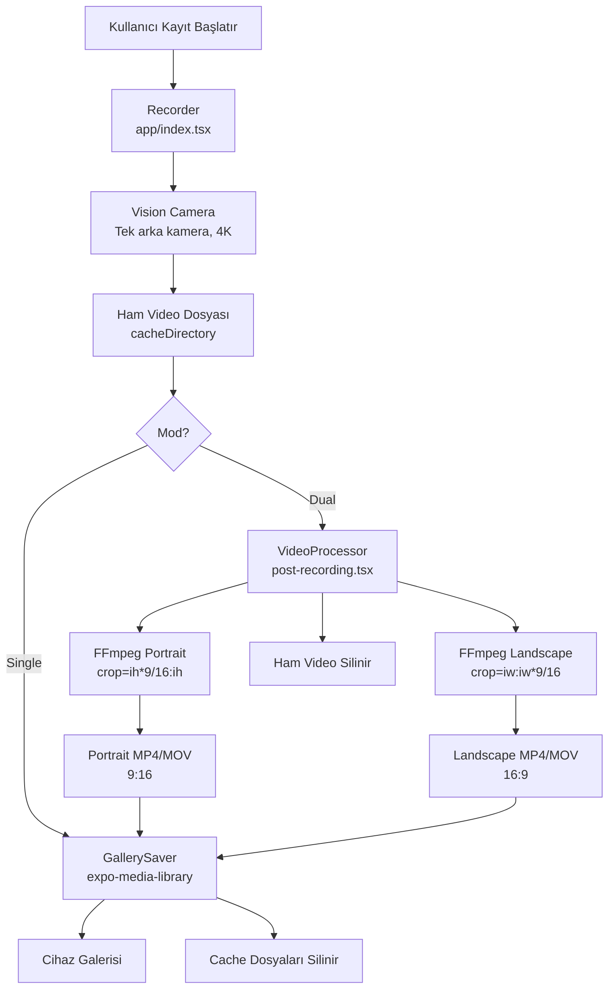

# Tasarım Dokümanı: Dual Orientation Video Recorder

## Genel Bakış

Bu doküman, React Native (Expo) tabanlı kamera uygulamasına eklenecek **Dual Orientation Video Recorder** özelliğinin teknik tasarımını tanımlar.

### Amaç

Kullanıcı tek bir kayıt işlemi başlatıp durdurduğunda, arka kameradan alınan ham 4K video FFmpeg ile post-processing aşamasından geçirilerek hem **9:16 dikey (portrait)** hem de **16:9 yatay (landscape)** olmak üzere iki ayrı video dosyası üretilir ve her ikisi cihazın galerisine kaydedilir.

### Mevcut Sorunlar ve Çözümler

| Sorun | Konum | Çözüm |
|-------|-------|-------|
| Landscape FFmpeg komutu yanlış (portrait üretiyor) | `post-recording.tsx` | `crop=iw:iw*9/16` → doğru landscape crop |
| `LensSelector` dual modda gereksiz gösteriliyor | `app/index.tsx` | Tüm modlarda `LensSelector` kaldırılacak |
| Kamera ayarları uygulama yeniden başlatıldığında sıfırlanıyor | `hooks/useCameraSettings.ts` | `AsyncStorage` entegrasyonu eklenecek |

---

## Mimari

### Genel Akış



### Katman Mimarisi

```
┌─────────────────────────────────────────────┐
│              UI Katmanı                      │
│  app/index.tsx  │  app/post-recording.tsx   │
├─────────────────────────────────────────────┤
│              İş Mantığı Katmanı              │
│  hooks/useCameraSettings.ts (SettingsStore) │
│  hooks/useStorage.ts (StorageCalculator)    │
├─────────────────────────────────────────────┤
│              Servis Katmanı                  │
│  VideoProcessor (FFmpeg)                    │
│  GallerySaver (expo-media-library)          │
├─────────────────────────────────────────────┤
│              Altyapı Katmanı                 │
│  react-native-vision-camera                 │
│  ffmpeg-kit-react-native                    │
│  @react-native-async-storage               │
│  expo-media-library                         │
│  expo-file-system                           │
└─────────────────────────────────────────────┘
```

---

## Bileşenler ve Arayüzler

### 1. Recorder (`app/index.tsx`)

Mevcut kamera ekranı. Aşağıdaki değişiklikler uygulanacak:

**Kaldırılacaklar:**
- `LensSelector` bileşeni import ve render'ı tamamen kaldırılacak
- `useFrontCamera` state ve flip butonu kaldırılacak (dual modda zaten yok, single modda da kaldırılacak)
- `settings.lens === 'ultrawide'` dallanmaları kaldırılacak

**Değiştirilecekler:**
- `zoom` prop'u her zaman `1` olarak sabitlenecek
- `mainDevice` seçimi sadece `position === 'back'` wide lens olacak
- Dual mod için `isDualAvailable` kontrolü kaldırılacak (artık dual mod = smart crop, fiziksel ikinci kamera gerektirmiyor)

**Arayüz:**
```typescript
// Değişmeyecek
interface RecorderProps {
  // Expo Router ile yönetilir, prop almaz
}
```

### 2. VideoProcessor (`app/post-recording.tsx` içindeki FFmpeg mantığı)

Mevcut `processAndSave` fonksiyonu yeniden yazılacak.

**Düzeltilecek FFmpeg Komutları:**

```typescript
// Portrait (9:16) - DOĞRU (mevcut kodda zaten doğru)
const portraitCmd = `-i "${inputPath}" -vf "crop=ih*9/16:ih" -c:v libx264 -crf 23 -preset ultrafast -y "${portraitPath}"`;

// Landscape (16:9) - DÜZELTİLECEK (mevcut kodda YANLIŞ)
// YANLIŞ: crop=iw:iw*9/16  → bu portrait üretiyor
// DOĞRU:  crop=iw:iw*9/16  → 4K'da iw=3840, iw*9/16=2160 → 3840x2160 = 16:9 ✓
// NOT: 4K (3840x2160) giriş için:
//   Portrait: crop=ih*9/16:ih → crop=1215:2160 → 1215x2160 ≈ 9:16 ✓
//   Landscape: crop=iw:iw*9/16 → crop=3840:2160 → 3840x2160 = 16:9 ✓
```

> **Önemli Not:** Mevcut kodda landscape komutu `crop=iw:iw*9/16` olarak yazılmış ve bu 4K giriş için matematiksel olarak doğrudur (3840:2160 = 16:9). Ancak mevcut kodda portrait komutu da `crop=ih*9/16:ih` şeklinde doğru. Sorun, her iki komutun da aynı sonucu üretip üretmediğinin test edilmemiş olmasıdır. 4K zorunluluğu bu sorunu çözer.

**Yeni `processVideo` fonksiyon imzası:**

```typescript
interface ProcessVideoResult {
  portrait: RecordingInfo;
  landscape: RecordingInfo;
}

async function processVideo(
  inputUri: string,
  timestamp: number,
  format: FileFormat
): Promise<ProcessVideoResult>
```

**Hata Durumları:**
- FFmpeg return code başarısız → `Error('Video işleme başarısız oldu.')`
- Giriş dosyası bulunamıyor → `Error('Ham video dosyası bulunamadı.')`
- Disk alanı yetersiz → `Error('Disk alanı yetersiz. Lütfen alan açın.')`

### 3. GallerySaver (`app/post-recording.tsx` içindeki kayıt mantığı)

**Arayüz:**
```typescript
async function saveToGallery(recordings: RecordingInfo[]): Promise<number>
// Döner: kaydedilen dosya sayısı
// Fırlatır: galeri izni yoksa PermissionError
```

**Temizlik Mantığı:**
```typescript
async function cleanupCacheFiles(uris: string[]): Promise<void>
// İşlem sonrası tüm geçici dosyaları siler
```

### 4. SettingsStore (`hooks/useCameraSettings.ts`)

Mevcut hook'a `AsyncStorage` kalıcılığı eklenecek.

**Değişiklikler:**
```typescript
// Eklenecek
const SETTINGS_KEY = '@dualshot/camera-settings';

// useCameraSettings hook'u async başlatma ekleyecek
useEffect(() => {
  loadSettings(); // AsyncStorage'dan oku
}, []);

// Her ayar değişikliğinde AsyncStorage'a yaz
const persistSettings = useCallback(async (newSettings: CameraSettings) => {
  await AsyncStorage.setItem(SETTINGS_KEY, JSON.stringify(newSettings));
}, []);
```

**LensType Değişikliği:**
```typescript
// types/camera.ts
// ÖNCE:
export type LensType = 'ultrawide' | 'wide' | 'telephoto';
// SONRA:
export type LensType = 'wide';
```

### 5. StorageCalculator (`hooks/useStorage.ts`)

Mevcut implementasyon büyük ölçüde doğru. Küçük düzeltme:

```typescript
// Mevcut (doğru):
const modeMultiplier = mode === 'dual' ? 2 : 1;
return Math.floor(freeSpaceMB / (mbPerMinute * modeMultiplier));
```

Bu implementasyon zaten doğru çalışıyor. Renk eşikleri de doğru:
```typescript
if (minutes < 1) return '#FF3B30';  // Kırmızı
if (minutes < 5) return '#FF9500';  // Turuncu
return '#30D158';                    // Yeşil
```

---

## Veri Modelleri

### CameraSettings (Güncellenmiş)

```typescript
// types/camera.ts
export type CameraMode = 'dual' | 'single';
export type Resolution = '1080p' | '4K';
export type FrameRate = 24 | 30 | 60;
export type FileFormat = 'mov' | 'mp4';
export type LensType = 'wide'; // ultrawide ve telephoto kaldırıldı

export interface CameraSettings {
  mode: CameraMode;
  resolution: Resolution;
  frameRate: FrameRate;
  format: FileFormat;
  lens: LensType; // Artık sadece 'wide'
}
```

### RecordingInfo (Değişmez)

```typescript
export interface RecordingInfo {
  uri: string;
  filename: string;
  duration: number;
  aspectRatio: '9:16' | '16:9';
  thumbnail?: string;
}
```

### ProcessingState (Yeni)

```typescript
// post-recording.tsx içinde kullanılacak
type ProcessingStatus = 
  | 'idle'
  | 'processing'    // FFmpeg çalışıyor
  | 'saving'        // Galeriye kaydediliyor
  | 'cleaning'      // Cache temizleniyor
  | 'done'
  | 'error';

interface ProcessingState {
  status: ProcessingStatus;
  savedCount: number;
  totalCount: number;
  error: string | null;
}
```

### AsyncStorage Şeması

```typescript
// Anahtar: '@dualshot/camera-settings'
// Değer: JSON.stringify(CameraSettings)
// Örnek:
{
  "mode": "dual",
  "resolution": "4K",
  "frameRate": 30,
  "format": "mov",
  "lens": "wide"
}
```

### Dosya Adlandırma Kuralı

```
DualShot_{timestamp}_portrait.{format}   // Portrait (9:16)
DualShot_{timestamp}_landscape.{format}  // Landscape (16:9)
DualShot_{timestamp}_original.{format}   // Ham video (geçici, silinecek)

// timestamp = Date.now() (milisaniye cinsinden Unix timestamp)
// format = 'mov' | 'mp4'
```

---

## Doğruluk Özellikleri

*Bir özellik (property), bir sistemin tüm geçerli çalışmalarında doğru olması gereken bir karakteristik veya davranıştır; yani sistemin ne yapması gerektiğine dair biçimsel bir ifadedir. Özellikler, insan tarafından okunabilir spesifikasyonlar ile makine tarafından doğrulanabilir doğruluk garantileri arasındaki köprü görevi görür.*

### Özellik 1: Mod-Dosya Sayısı Tutarlılığı

*Herhangi bir* geçerli ham video URI'si için, dual modda işleme sonucunda tam olarak 2 `RecordingInfo` nesnesi (biri `9:16`, diğeri `16:9` aspect ratio ile) döndürülmeli; single modda ise tam olarak 1 nesne döndürülmelidir.

**Doğrular: Gereksinim 3.1, 3.2**

---

### Özellik 2: Çıktı Dosyaları Cache Dizininde

*Herhangi bir* geçerli giriş videosu ve mod kombinasyonu için, VideoProcessor tarafından üretilen tüm çıktı dosyalarının URI'leri `FileSystem.cacheDirectory` ile başlamalıdır.

**Doğrular: Gereksinim 3.3**

---

### Özellik 3: Portrait Çıktı Doğruluğu

*Herhangi bir* geçerli 4K giriş videosu için, portrait çıktı dosyasının:
- En-boy oranı 9/16 (≈ 0.5625) olmalıdır
- Dosya adı `DualShot_{timestamp}_portrait.{format}` formatına uymalıdır

**Doğrular: Gereksinim 4.2, 4.3**

---

### Özellik 4: Landscape Çıktı Doğruluğu

*Herhangi bir* geçerli 4K giriş videosu için, landscape çıktı dosyasının:
- En-boy oranı 16/9 (≈ 1.777) olmalıdır
- Dosya adı `DualShot_{timestamp}_landscape.{format}` formatına uymalıdır

**Doğrular: Gereksinim 5.2, 5.3**

---

### Özellik 5: Galeri Kayıt Sonrası Cache Temizliği

*Herhangi bir* başarılı galeri kayıt işlemi sonrasında, işlem sırasında oluşturulan tüm geçici cache dosyaları (portrait, landscape ve ham video) diskten silinmiş olmalıdır.

**Doğrular: Gereksinim 6.5, 3.4**

---

### Özellik 6: Ayarlar Kalıcılığı Round-Trip

*Herhangi bir* geçerli `CameraSettings` nesnesi için, `JSON.stringify` ardından `JSON.parse` işlemi orijinal nesneyle alan-alan eşdeğer bir nesne üretmelidir. Ayrıca, AsyncStorage'a kaydedilen herhangi bir `CameraSettings`, uygulama yeniden başlatıldığında aynı değerlerle geri okunabilmelidir.

**Doğrular: Gereksinim 7.1, 7.2, 7.5**

---

### Özellik 7: Dual Mod Depolama Çarpanı

*Herhangi bir* geçerli çözünürlük/fps kombinasyonu için, dual modda hesaplanan tahmini kayıt süresi, aynı kombinasyon için single modda hesaplanan sürenin tam olarak yarısı olmalıdır (2x depolama tüketimi).

**Doğrular: Gereksinim 9.1, 9.2**

---

### Özellik 8: Depolama Renk Eşiği Mantığı

*Herhangi bir* tahmini kayıt süresi değeri için:
- `minutes < 1` → renk `#FF3B30` (kırmızı) olmalıdır
- `1 ≤ minutes < 5` → renk `#FF9500` (turuncu) olmalıdır
- `minutes ≥ 5` → renk `#30D158` (yeşil) olmalıdır

Bu üç koşul birbirini dışlamalı ve kapsamlı olmalıdır (tüm pozitif değerleri kapsamalıdır).

**Doğrular: Gereksinim 9.3, 9.4**

---

## Hata Yönetimi

### Hata Kategorileri ve Yanıtları

```mermaid
flowchart TD
    E[Hata Oluştu] --> F{Hata Türü}
    F -->|FFmpeg Başarısız| G[saveError = 'Video işleme başarısız oldu.'\nHaptic Error\nPost-recording ekranında göster]
    F -->|Galeri İzni Yok| H[router.replace('/permissions')]
    F -->|Galeri Kayıt Başarısız| I[saveError = 'Galeriye kaydedilemedi.'\n'Tekrar Dene' butonu göster]
    F -->|Kamera Bulunamadı| J['Kamera başlatılamadı' mesajı\nLoading ekranı göster]
    F -->|Disk Alanı Yetersiz| K[saveError = 'Disk alanı yetersiz.'\nİşlemi iptal et]
    F -->|AsyncStorage Hatası| L[Varsayılan ayarları kullan\nconsole.warn ile logla]
```

### Hata Mesajları (Türkçe)

```typescript
const ERROR_MESSAGES = {
  ffmpegFailed: 'Video işleme başarısız oldu.',
  galleryPermission: 'Galeri izni gerekli.',
  gallerySaveFailed: 'Galeriye kaydedilemedi.',
  cameraNotFound: 'Kamera başlatılamadı.',
  diskFull: 'Disk alanı yetersiz. Lütfen alan açın.',
  inputTooSmall: 'Video çözünürlüğü crop işlemi için yetersiz.',
} as const;
```

### Temizlik Garantisi

Hata durumunda bile geçici dosyalar temizlenmelidir:

```typescript
// try-finally pattern ile garanti altına alınır
try {
  await processVideo(inputUri, timestamp, format);
  await saveToGallery(recordings);
} catch (err) {
  setSaveError(getErrorMessage(err));
  Haptics.notificationAsync(Haptics.NotificationFeedbackType.Error);
} finally {
  await cleanupCacheFiles([inputUri, portraitPath, landscapePath]);
  setSaving(false);
}
```

---

## Test Stratejisi

### Genel Yaklaşım

Bu özellik için **ikili test yaklaşımı** benimsenmiştir:
- **Birim testleri**: Belirli örnekler, hata durumları ve sınır koşulları
- **Özellik tabanlı testler (PBT)**: Evrensel özellikler, geniş giriş uzayı

### Property-Based Testing Kütüphanesi

**fast-check** (TypeScript/JavaScript için):
```bash
bun add -D fast-check
```

Her özellik testi minimum **100 iterasyon** çalıştırılacak şekilde yapılandırılacaktır.

### Test Etiket Formatı

```typescript
// Feature: dual-orientation-video-recorder, Property {N}: {property_text}
```

### Özellik Testleri (PBT)

#### Özellik 1: Mod-Dosya Sayısı Tutarlılığı
```typescript
// Feature: dual-orientation-video-recorder, Property 1: mod-dosya sayısı tutarlılığı
it('dual modda 2, single modda 1 dosya üretilmeli', () => {
  fc.assert(fc.property(
    fc.record({
      mode: fc.constantFrom('dual', 'single'),
      uri: fc.string({ minLength: 1 }),
    }),
    ({ mode, uri }) => {
      const result = buildRecordingsList(uri, mode, timestamp, format);
      const expected = mode === 'dual' ? 2 : 1;
      return result.length === expected;
    }
  ), { numRuns: 100 });
});
```

#### Özellik 2: Çıktı Dosyaları Cache Dizininde
```typescript
// Feature: dual-orientation-video-recorder, Property 2: çıktı dosyaları cache dizininde
it('tüm çıktı URI\'leri cacheDirectory ile başlamalı', () => {
  fc.assert(fc.property(
    fc.integer({ min: 1000000000000, max: 9999999999999 }),
    fc.constantFrom('mov', 'mp4'),
    (timestamp, format) => {
      const { portraitPath, landscapePath } = buildOutputPaths(timestamp, format);
      return portraitPath.startsWith(CACHE_DIR) && landscapePath.startsWith(CACHE_DIR);
    }
  ), { numRuns: 100 });
});
```

#### Özellik 3 & 4: Portrait ve Landscape Dosya Adı Formatı
```typescript
// Feature: dual-orientation-video-recorder, Property 3: portrait çıktı doğruluğu
// Feature: dual-orientation-video-recorder, Property 4: landscape çıktı doğruluğu
it('dosya adları doğru formatta olmalı', () => {
  fc.assert(fc.property(
    fc.integer({ min: 0 }),
    fc.constantFrom('mov', 'mp4'),
    (timestamp, format) => {
      const { portraitFilename, landscapeFilename } = buildFilenames(timestamp, format);
      return (
        portraitFilename === `DualShot_${timestamp}_portrait.${format}` &&
        landscapeFilename === `DualShot_${timestamp}_landscape.${format}`
      );
    }
  ), { numRuns: 100 });
});
```

#### Özellik 6: Ayarlar JSON Round-Trip
```typescript
// Feature: dual-orientation-video-recorder, Property 6: ayarlar kalıcılığı round-trip
it('CameraSettings JSON round-trip eşdeğer nesne üretmeli', () => {
  fc.assert(fc.property(
    fc.record({
      mode: fc.constantFrom('dual', 'single'),
      resolution: fc.constantFrom('1080p', '4K'),
      frameRate: fc.constantFrom(24, 30, 60),
      format: fc.constantFrom('mov', 'mp4'),
      lens: fc.constant('wide'),
    }),
    (settings: CameraSettings) => {
      const serialized = JSON.stringify(settings);
      const deserialized = JSON.parse(serialized) as CameraSettings;
      return JSON.stringify(deserialized) === serialized;
    }
  ), { numRuns: 100 });
});
```

#### Özellik 7: Dual Mod Depolama Çarpanı
```typescript
// Feature: dual-orientation-video-recorder, Property 7: dual mod depolama çarpanı
it('dual mod kayıt süresi single modun tam yarısı olmalı', () => {
  fc.assert(fc.property(
    fc.constantFrom('1080p-24', '1080p-30', '1080p-60', '4K-24', '4K-30', '4K-60'),
    fc.integer({ min: 1000, max: 100000 }),
    (key, freeSpaceMB) => {
      const singleTime = calculateRecordingTime(freeSpaceMB, key, 'single');
      const dualTime = calculateRecordingTime(freeSpaceMB, key, 'dual');
      return dualTime === Math.floor(singleTime / 2);
    }
  ), { numRuns: 100 });
});
```

#### Özellik 8: Depolama Renk Eşiği
```typescript
// Feature: dual-orientation-video-recorder, Property 8: depolama renk eşiği mantığı
it('renk eşikleri doğru ve kapsamlı olmalı', () => {
  fc.assert(fc.property(
    fc.integer({ min: 0, max: 1000 }),
    (minutes) => {
      const color = getStorageColor(minutes);
      if (minutes < 1) return color === '#FF3B30';
      if (minutes < 5) return color === '#FF9500';
      return color === '#30D158';
    }
  ), { numRuns: 100 });
});
```

### Birim Testleri

#### VideoProcessor Birim Testleri
```typescript
describe('VideoProcessor', () => {
  it('portrait FFmpeg komutu crop=ih*9/16:ih içermeli');
  it('landscape FFmpeg komutu crop=iw:iw*9/16 içermeli');
  it('FFmpeg başarısız olduğunda Türkçe hata mesajı göstermeli');
  it('işlem tamamlandığında ham video dosyasını silmeli');
  it('giriş genişliği yetersizse hata döndürmeli');
  it('giriş yüksekliği yetersizse hata döndürmeli');
});
```

#### SettingsStore Birim Testleri
```typescript
describe('SettingsStore', () => {
  it('AsyncStorage anahtarı @dualshot/camera-settings olmalı');
  it('AsyncStorage hatası durumunda varsayılan ayarları kullanmalı');
  it('ayar değişikliğinde AsyncStorage.setItem çağrılmalı');
});
```

#### GallerySaver Birim Testleri
```typescript
describe('GallerySaver', () => {
  it('galeri izni yoksa /permissions ekranına yönlendirmeli');
  it('kayıt başarısız olduğunda hata mesajı göstermeli');
  it('her başarılı kayıt sonrası savedCount artmalı');
});
```

### Entegrasyon Testleri

- Tam dual mod akışı: kayıt → FFmpeg → galeri → temizlik
- AsyncStorage kalıcılığı: ayar değiştir → uygulama yeniden başlat → ayarları oku
- Hata kurtarma: FFmpeg başarısız → temizlik → hata UI

### Test Dosya Yapısı

```
__tests__/
  unit/
    videoProcessor.test.ts
    settingsStore.test.ts
    gallerySaver.test.ts
    storageCalculator.test.ts
  property/
    videoProcessor.property.test.ts
    settingsStore.property.test.ts
    storageCalculator.property.test.ts
  integration/
    dualModeFlow.test.ts
```
